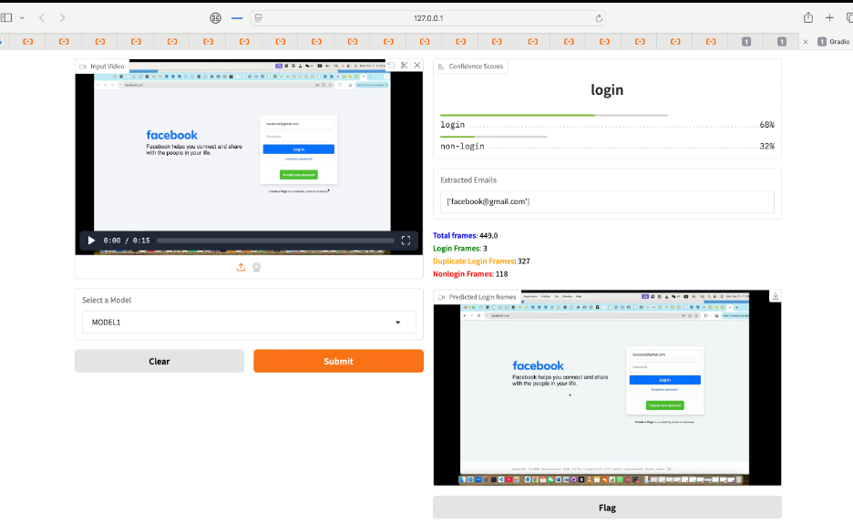

# Gradio App: [Email Detection From Videos]

  
[](LICENSE)

Welcome to the **[Email Detection From Videos]**, this app provides a powerful video processing pipeline that first uses a deep learning model to detect and extract login and non-login frames. Once the key frames are identified, the app applies image processing techniques to remove duplicate frames, optimizing the video data. Next, OCR is utilized to extract all text from the frames, enabling further analysis. To wrap up the process, an email regular expression (regex) is applied to identify and extract potential email addresses from the extracted text, making this app ideal for analyzing and extracting actionable data from videos..

## Demo


Try it out on video [here](https://huggingface.co/spaces/Hussain5/Email-Detection-From-Videos) (optional).
Try it out on images [here](https://huggingface.co/spaces/Hussain5/Email-Detection-From-Images) (optional).

---


## Installation

To run this app locally, ensure you have Python installed. Then follow these steps:

```bash
# Clone the repository
git clone https://github.com/Hussainflr/login_detection.git
cd login_detection

# Install the required dependencies
pip install -r requirements.txt
```
### 3. Setup Configuration (`config.yaml`)

Before you proceed with the setup, you need an Alibaba Cloud account. Once you have created an account and logged in, follow these steps:

1. **Create a Bucket in Alibaba Cloud**  
   You will need to create a bucket in Alibaba Cloud's **Object Storage Service (OSS)** to store your data (e.g., OCR results or video frames). Here's how to do it:
   
   - Log in to your [Alibaba Cloud Console](https://home.console.aliyun.com/).
   - Go to **Object Storage Service (OSS)** and click on **Create Bucket**.
   - Choose a region, enter a bucket name, and select the **Public** access option (this will make your bucket publicly accessible).
   - Once the bucket is created, note down the **Bucket Name** and **Bucket URL**.

2. **Set the Bucket to Public**  
   To make sure the bucket is public, follow these steps:
   - In the **OSS** section of your console, navigate to the bucket you just created.
   - Go to the **Permissions** tab and enable **Public Read Access** (this will allow public access to the files in the bucket).

3. **Configure `config.yaml` with Alibaba Cloud Credentials**
   
   In the `config.yaml` file, you'll need to add your **Access Key ID**, **Access Key Secret**, and the **Bucket Name**. Here’s how you do it:

   - Log in to your [Alibaba Cloud Console](https://home.console.aliyun.com/).
   - Navigate to **AccessKey Management** under **RAM (Resource Access Management)**.
   - If you don't have an Access Key, create one, and copy the **Access Key ID** and **Access Key Secret**.
   - Now, open the `config.yaml` file and add the following information:

```yaml
credentials:
  ALIBABA_CLOUD_ACCESS_KEY_ID: "add ALIBABA_CLOUD_ACCESS_KEY_ID"
  ALIBABA_CLOUD_ACCESS_KEY_SECRET: "add ALIBABA_CLOUD_ACCESS_KEY_SECRET here"
credentials:
  ALIBABA_CLOUD_ACCESS_KEY_ID: "add ALIBABA_CLOUD_ACCESS_KEY_ID"
  ALIBABA_CLOUD_ACCESS_KEY_SECRET: "add ALIBABA_CLOUD_ACCESS_KEY_SECRET here"

api:
  ENDPOINT: oss-cn-beijing.aliyuncs.com
  BUCKET_NAME: "bucketname"

## Usage

Run the app with:

```bash
python app_video.py
```

Once the server is running, go to `http://127.0.0.1:7860/` in your browser to use the app.


---

## Screenshots



---

## Contributing

Contributions are welcome! 

---

## License

This project is licensed under the MIT License - see the [LICENSE](LICENSE) file for details.

---

## Acknowledgements

- [DTC](https://www.dbs.com) - for organizing amazing Hacathon.
- [ALIBABA](https://www.aliyun.com/) - for providing the ALIBABA cloud.
